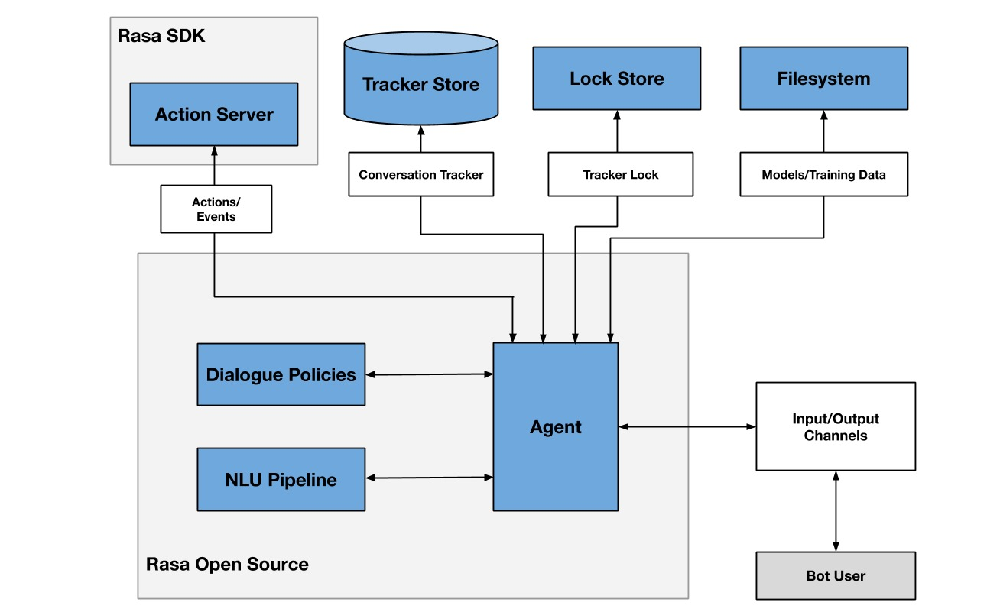

# ChatBot Rasa

- Python 3.10

## Executar o bot

1. Para instalar as dependencias use o comando: `pip install -r requirements.txt`
2. Para treinar o rasa use: `rasa train`
3. Para executar o bot em modo API: `rasa run --enable-api`
4. Execute o script main.py: `python main.py`
5. Acesse o discord e converse com o bot `Notifier#2163`

## Arquitetura

- Tracker Stores: O Tracker Store é responsável por armazenar e recuperar o histórico das conversas (trackers) entre o usuário e o assistente virtual.
Ele registra todos os eventos, como mensagens, ações tomadas pelo assistente e outras informações relevantes.
O Rasa suporta diferentes tipos de Tracker Stores, como armazenamento em memória, banco de dados SQL e banco de dados NoSQL, permitindo escolher a opção adequada para cada caso.
- Event Brokers: O Event Broker é responsável por gerenciar a comunicação entre os diferentes componentes do Rasa.
Ele recebe os eventos dos Trackers Stores e os encaminha para os outros componentes relevantes.
Além disso, o Event Broker permite a integração com outros serviços e plataformas externas, como Slack, Facebook Messenger, entre outros.
- Model Storage: O Model Storage é onde os modelos de linguagem e de aprendizado de máquina do Rasa são armazenados.
Ele permite o treinamento, o armazenamento e a recuperação dos modelos necessários para a compreensão da linguagem natural e a tomada de decisões pelos assistentes virtuais do Rasa.
- Lock Stores: O Lock Store é utilizado para garantir a consistência e a sincronização entre os diferentes processos ou instâncias do Rasa.
Ele é responsável por bloquear recursos compartilhados para evitar conflitos durante o treinamento, a execução e o armazenamento dos modelos.
- Secrets Managers: O Secrets Manager é usado para armazenar e gerenciar informações sensíveis, como chaves de API, tokens de autenticação e outras credenciais.
Ele garante que essas informações estejam seguras e acessíveis apenas para os componentes autorizados do Rasa.

## Intents
- Intent: solicitar_saudacao

        Exemplo de entrada: "Olá"
        Resposta do bot: "Olá! Você deseja comprar 
        ou alugar um imóvel?"

- Intent: informar_interesse_compra
        
        Exemplo de entrada: "Comprar imóvel"
        Resposta do bot: "Ótimo! Por favor, me informe algumas características que você deseja no imóvel. Qual o número de quartos esperado?"

- Intent: informar_interesse_alguel
        
        Exemplo de entrada: "Alugar imóvel"
        Resposta do bot: "Ótimo! Por favor, me informe algumas características que você deseja no imóvel. Qual o número de quartos esperado?"

- Intent: solicitar_quantidade_quartos

        Exemplo de entrada: "4 quartos"
        Resposta do bot: "Entendi. Qual é a faixa de preço que você está considerando para o imóvel?
        1 - Até R$100.000
        2 - Entre R$100.001 e R$300.000
        3 - Mais de R$300.000"

- Intent: informar_faixa_preco_geral
       
        Exemplo de entrada: "1"
        Resposta do bot: "Anotado. Você gostaria que o bairro fosse seguro? Por favor, informe se a segurança do bairro é uma prioridade para você."

- Intent: informar_bairro_seguro

        Exemplo de entrada: "Sim, a segurança do bairro é uma prioridade para mim."
        Resposta do bot: "Legal. Você tem alguma preferência em relação ao tamanho do terreno? Por favor, informe suas preferências quanto ao tamanho do terreno desejado."

- Intent: informar_tamanho_terreno

        Exemplo de entrada: "Gostaria de um terreno espaçoso"
        Resposta do bot: "Certo. Você pretende financiar o imóvel? Por favor, informe se você tem intenção de financiar a compra do imóvel."

- Intent: informar_financiamento

        Exemplo de entrada: "Sim, pretendo financiar o imóvel"
        Resposta do bot: "Boa escolha. Por favor, informe seu endereço de e-mail para que possamos entrar em contato com você."

- Intent: informar_email

        Exemplo de entrada: "Meu e-mail é exemplo@email.com"
        Resposta do bot: "Obrigado por fornecer todas as informações necessárias. Nossa equipe entrará em contato em breve para apresentar opções de imóveis que atendam aos seus critérios. Se você tiver alguma dúvida adicional, não hesite em perguntar. Até breve!"

- Intent: sair

        Exemplo de entrada: "tchau"
        Resposta do bot: "Espero ter sido um bom bot, adeus!"
